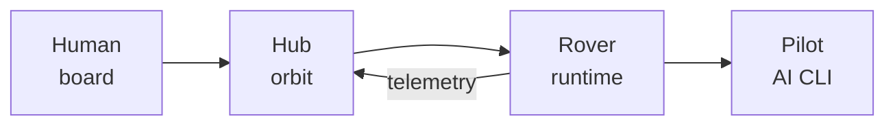
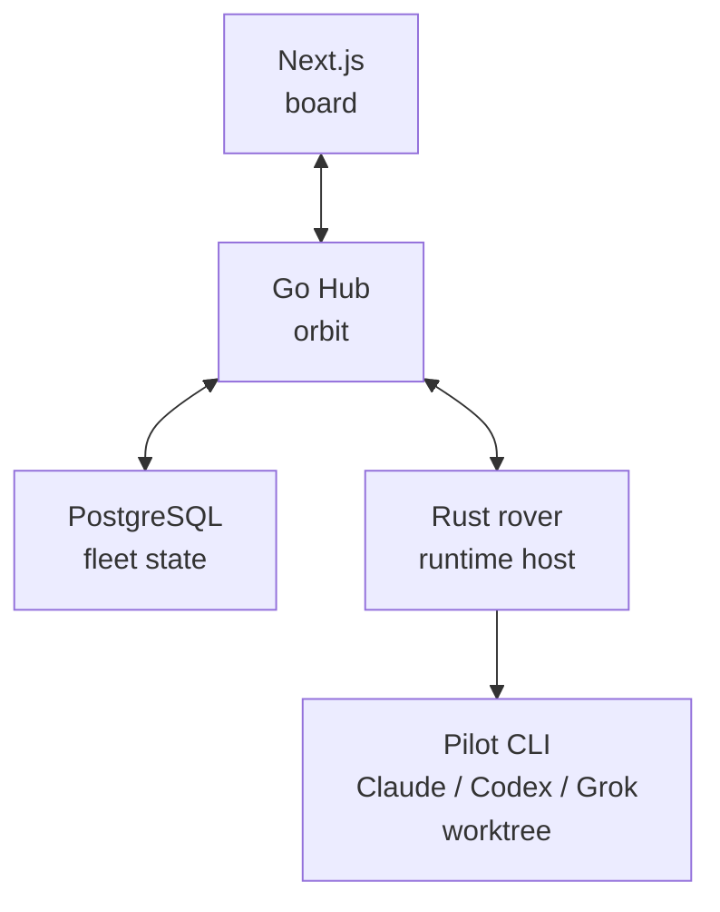

# UFO: Unified Fleet Orchestrator

**An open-source zero-human ops platform** 🦾🩶

**English | [简体中文](README.zh-CN.md)**

Stand up a **fleet**. Put **operations** on the board. **Rovers** connect
human-controlled runtimes to local **pilots** (Claude, Codex, Grok, …) and
carry shared context, history, and diffs back to the Hub — so the next leg can
continue from the same operational picture.


[](https://github.com/fengsi/ufo/actions/workflows/ci.yml)
[](https://github.com/fengsi/ufo/releases)
[](https://crates.io/crates/ufo-cli)
[](LICENSE)
[](CHANGELOG.md)
[](apps/api/go.mod)
[](apps/web/package.json)
[](apps/rover/Cargo.toml)
[](https://gitmoji.dev)

> **Public beta.** The core loop works. Prefer
> [tagged releases](https://github.com/fengsi/ufo/releases); APIs and schema
> may still change before 1.0 — see [CHANGELOG.md](CHANGELOG.md).

---

## Why UFO?

Most agent setups still live as separate sessions: context is split across
chat tabs, terminals, local worktrees, and human notes. Each run may work, but
the shared operational picture gets lost between handoffs.

| Chat / one-shot agents | UFO |
| --- | --- |
| Context is scattered across sessions | **Operations** carry shared history in the fleet |
| Humans coordinate every handoff | **Routines** and **crews** launch the next leg |
| Local runs stay isolated from shared state | **Rovers** bridge local runtimes into one Hub |
| “Who ran what?” is tribal | Board, **signals**, diffs, membership |

Humans keep **Claude Code**, **Codex**, **Grok Build**, and the rest. UFO is
the **fleet** layer — one Hub, many rovers, shared context.

---

## Features

- **Dispatch work** — open an **operation**, assign a **pilot**; a **rover**
  connects the local runtime to the fleet.
- **Mission control board** — Kanban / list / lanes; comments, assets,
  labels, relationships, **signals**.
- **Local stays local** — code and secrets stay on hosts humans control;
  no required cloud.
- **Isolated worktrees** — each run gets its own checkout; apply, branch, or
  refresh from source when ready.
- **Autonomous legs** — **routines** re-pulse after **done**; optional
  auto-commit branch for unattended self-dev (stall / fail-closed guards).
- **Fleet skills** — reusable packs (`SKILL.md`) bound to operations or
  **crews**; materialised into the worktree for the pilot.
- **Crews & membership** — fleets, roles, email invites, crews (pilots +
  humans).
- **Bring the pilots** — Claude Code, Codex, Antigravity, Grok Build, Cursor
  Agent, GitHub Copilot, Amp Code, OpenCode, OpenClaw, Hermes, Pi, Kimi, Kiro
  (binary on `PATH`).

---

## Screenshots

**Hub**


**Rover**


---

## Quick start (local)

No cloud account. Stand up a **Hub** on this machine, then connect a
**rover**.

**Needs:** [Docker](https://docs.docker.com/get-docker/) and
[Rust/Cargo](https://rustup.rs) (rovers run on the **host**, so they can use
local files and AI CLIs).

### 1. Start the Hub

```bash
git clone https://github.com/fengsi/ufo.git
cd ufo
scripts/dev.sh up          # Postgres + API + web (live reload)
```

- Board (mission control): **http://localhost:3000**
- Hub API (rover `--hub`): **http://localhost:8080**

### 2. Sign up

Open **http://localhost:3000** and create an account — UFO opens a personal
**fleet** and a default **Launch Bay** **mission**.

### 3. Enroll a rover

```bash
scripts/dev.sh rover enroll
```

Approve enrollment in the browser when prompted. Later runs:

```bash
scripts/dev.sh rover
```

> **Rover** — local runtime connector that accepts work from the Hub, runs a
> **pilot** (local AI CLI) in an isolated worktree, and reports status and
> diffs back to the board.

One rover host can keep multiple enrollments, including enrollments for
different Hubs. Start the rover once and every stored enrollment stays ready;
set `units` per rover to accept concurrent operations while reusing the same
local AI CLIs on `PATH`.

### 4. Put a pilot on PATH

Install at least one supported CLI and ensure it’s on `PATH` (e.g. `claude`,
`codex`, `grok`, `copilot`, …). The rover only runs pilots it can find.

### 5. Dispatch the first operation

1. Open a **mission** (project frame on the fleet).
2. Drop an **operation** (the work unit).
3. Assign a **pilot**.
4. Watch the board: queued → accepted → running → review/done, with live
   updates and a diff when code changed.

That’s the loop. Routines, skills, crews, and auto-commit all build on it.

---

## Rover CLI binary (optional)

Both rover commands need a running Hub. Today’s public beta path is a local
Hub from `scripts/dev.sh up`; use either the dev wrapper or the released CLI
binary to connect a rover to it.

```bash
# macOS / Linux
curl -fsSL https://getufo.dev/install.sh | sh
# or: brew install fengsi/ufo/ufo-cli

# with the local Hub already running from scripts/dev.sh up
ufo rover enroll --hub http://localhost:8080
ufo rover start
```

To connect the same host to another Hub, enroll again with that Hub URL (or
use repeated `--config` entries with enrollment codes). `ufo rover start`
loads the stored enrollments from `~/.ufo/rovers.json`.

**Windows:** download the matching archive from
[Releases](https://github.com/fengsi/ufo/releases), put `ufo.exe` on
`PATH`, then the same `enroll` / `start` commands. Details:
[apps/rover/README.md](apps/rover/README.md).

Tested on **macOS, FreeBSD, Linux, and Windows**.

---

## Words on the board

| Word | Plain meaning |
| --- | --- |
| **Fleet** | Trust boundary — owns missions, operations, and rovers |
| **Mission** | Project frame on a fleet (codes like `MSJ-123`) |
| **Operation** | One unit of work on the board |
| **Hub** | Control plane in “orbit” (API + state) |
| **Rover** | Local runtime connector that accepts work and runs pilots |
| **Pilot** | Local AI CLI the rover runs |
| **Routine** | Recurring launch pattern (schedule or re-pulse loop) |
| **Skill** | Reusable instruction pack bound to ops or crews |
| **Crew** | Pilots + humans under one assignment target |



---

## How the pieces fit

| Piece | Role |
| --- | --- |
| [`apps/web`](apps/web) | Mission control board |
| [`apps/api`](apps/api) | Hub — auth, queues, OpenAPI |
| [`apps/rover`](apps/rover) | Local runtime connector (`ufo-cli`) that runs pilots |



**Trust note:** anyone in a fleet can dispatch work to that fleet’s rovers.
Pilots run as the OS user that started the rover. Dedicated account or host
for serious fleets — see [SECURITY.md](SECURITY.md).

---

## Configuration

Copy [`.env.example`](.env.example) to `.env` for overrides.

| Variable | Default | Who |
| --- | --- | --- |
| `UFO_HUB_URL` | `http://localhost:8080` | rover, web |
| `UFO_HUB_DATABASE_URL` | local Docker Postgres | api |
| `UFO_HUB_JWT_PRIVATE_KEY` | required in production | api |
| `UFO_HUB_JWT_ALLOW_EPHEMERAL` | set `1` for local-only | api |

Full list: [`.env.example`](.env.example),
[`.env.production.example`](.env.production.example).

---

## Advanced: host-only API/web

Go ≥ 1.26 and Node ≥ 20.9 on the host; Postgres still via Docker:

```bash
scripts/dev.sh db
scripts/dev.sh api
scripts/dev.sh web
scripts/dev.sh rover enroll
```

Contributor workflow: [CONTRIBUTING.md](CONTRIBUTING.md).

---

## Troubleshooting

| Symptom | Try |
| --- | --- |
| Web won’t load | `docker compose ps` · `docker compose logs -f web api postgres` |
| API can’t reach DB | `scripts/dev.sh up` or `db`; check `UFO_HUB_DATABASE_URL` |
| Browser calls fail after login | Set `UFO_HUB_ALLOWED_ORIGINS` to the web origin; secure cookies only on HTTPS |
| Rover won’t enroll | `--hub` must be the **API** origin; approve in the browser |
| Online but idle | Pilot assigned? CLI on `PATH`? Tags match? |
| Wipe local Docker data | `scripts/dev.sh down -v && scripts/dev.sh up` (destructive) |

---

## Docs

| Doc | For |
| --- | --- |
| [Rover CLI](apps/rover/README.md) | Install, enroll, TUI, headless |
| [OpenAPI](apps/api/internal/spec/openapi.yaml) | HTTP contract |
| [Contributing](CONTRIBUTING.md) | PRs, monorepo, beta DB notes |
| [Security](SECURITY.md) | Fleet trust and rover risk |
| [Changelog](CHANGELOG.md) | Releases |

---

## Contributing

Issues, [Discussions](https://github.com/fengsi/ufo/discussions), and PRs are
welcome — start with [CONTRIBUTING.md](CONTRIBUTING.md).

During the public beta, schema changes usually land in one init migration.
When release notes mention a schema reset, back up or wipe local DBs before
upgrading.

---

## License

UFO is licensed under [BSD 3-Clause](LICENSE). Third-party license notices are
listed in [THIRD_PARTY_NOTICES.md](THIRD_PARTY_NOTICES.md).
