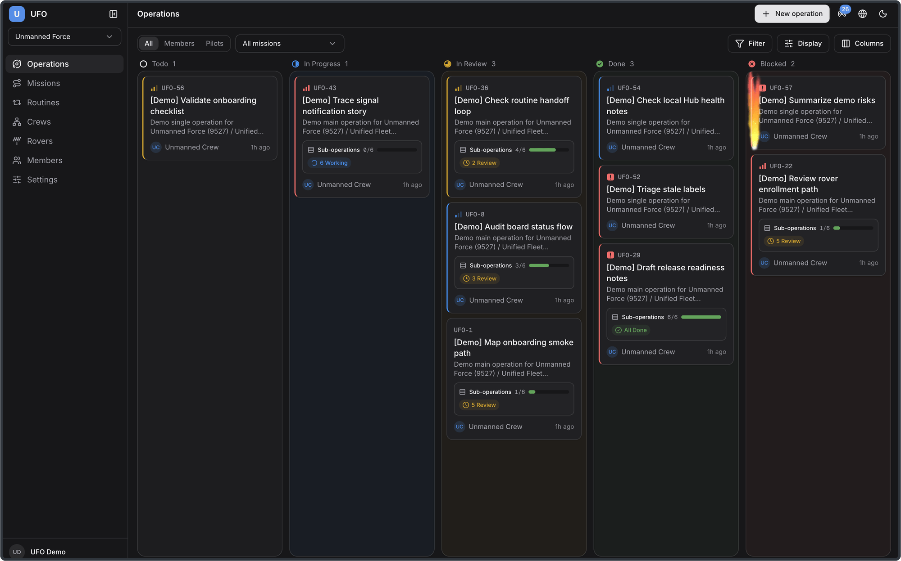
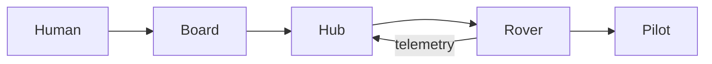
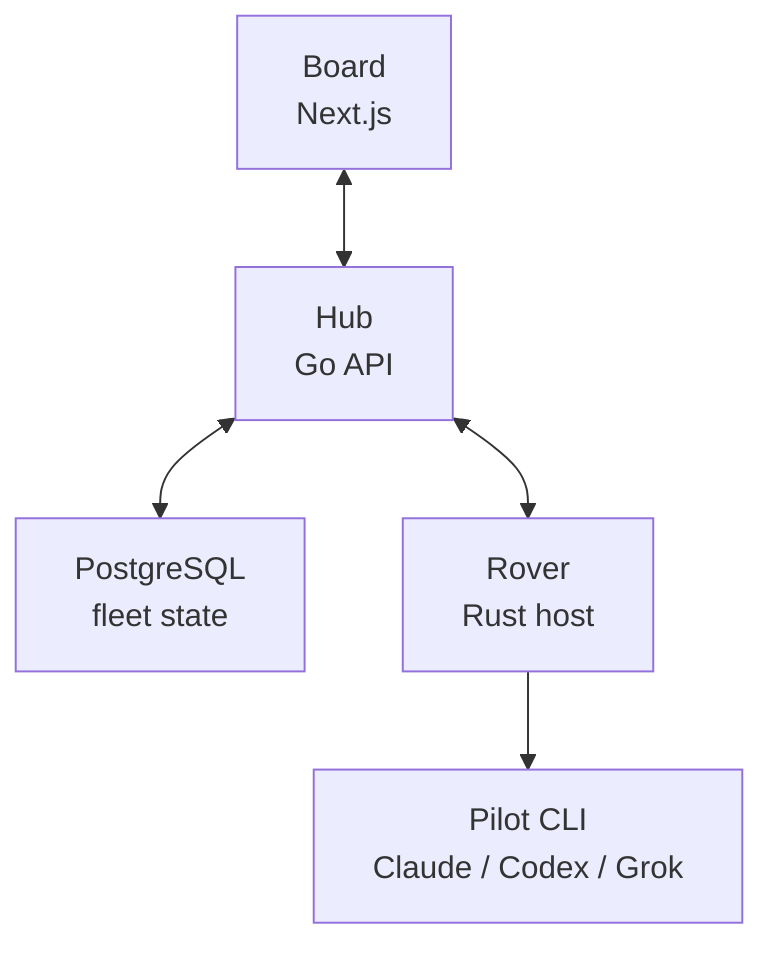

<h1 align="center">UFO: Unified Fleet Orchestrator</h1>

<p align="center"><strong>An open-source zero-human ops platform</strong> 🦾🩶</p>

<p align="center">
  Connect AI sessions into a zero-human ops loop: keep context, route work,
  and hand off across runs!
</p>

<p align="center">
  <a href="https://github.com/fengsi/ufo/actions/workflows/ci.yml"></a>
  <a href="https://github.com/fengsi/ufo/releases"></a>
  <a href="https://crates.io/crates/ufo-cli"></a>
  <a href="LICENSE"></a>
  <a href="CHANGELOG.md"></a>
  <a href="apps/api/go.mod"></a>
  <a href="apps/web/package.json"></a>
  <a href="apps/rover/Cargo.toml"></a>
  <a href="https://gitmoji.dev"></a>
</p>

<p align="center"><strong>English | <a href="README.zh-CN.md">简体中文</a></strong></p>


> **Public beta.** The core loop works. Prefer
> [tagged releases](https://github.com/fengsi/ufo/releases); APIs and schema
> may still change before 1.0. See [CHANGELOG.md](CHANGELOG.md).

---

## What is UFO?

UFO connects AI sessions into a zero-human ops loop for complex work, not just
coding. Work lands on the **board**, context keeps compounding, and each run
can hand off cleanly to the next while workspaces and credentials stay on
machines you control.

Three layers:

| Layer | Role |
| --- | --- |
| **Fleet** | Trust boundary: people, rovers, missions, and operations |
| **Hub** | Control plane: API and fleet state |
| **Board** | Web UI for the fleet |

**Missions** frame projects. **Operations** are work items on the board.
**Routines** launch work on a schedule or after completion. **Rovers** run
local **Pilots** (Claude Code, Codex, Grok Build, ...). Humans stay in the
fleet when needed; the product direction is zero-human ops.

---

## Why UFO?

Most agent setups still live across separate sessions: context is split
between chat tabs, terminals, local worktrees, and human notes. Each run can
work well, but handoffs lack one shared operational picture.

| Standalone AI sessions | UFO |
| --- | --- |
| Context stays session-local | **Operations** carry shared history in the fleet |
| Handoffs are mostly manual | **Routines** and **crews** launch the next leg |
| Local runs need a shared state bridge | **Rovers** bridge local runtimes into one Hub |
| "Who ran what?" is tribal | **Board**, **signals**, diffs, membership |

Humans keep **Claude Code**, **Codex**, **Grok Build**, and the rest. UFO is
the **Fleet** layer on top. One Hub, one Board, people and rovers under the
same trust boundary.

---

## Features

- **Dispatch work.** Open an **operation**, assign a **pilot**; a **rover**
  connects the local runtime to the fleet.
- **Board.** Kanban, list, and lanes; comments, assets, labels, relationships,
  **signals**.
- **Local stays local.** Code and secrets stay on hosts humans control; no
  required cloud.
- **Isolated worktrees.** Each run gets its own checkout; apply, branch, or
  refresh from source when ready.
- **Autonomous legs.** **Routines** re-pulse after **done**; optional
  auto-commit branch for unattended re-pulse loops (stall / fail-closed
  guards).
- **Skills.** Reusable packs (`SKILL.md`) on the fleet, bound to operations or
  **crews**; materialised into the worktree for the pilot.
- **Crews & membership.** Fleets, roles, email invites, crews (pilots +
  humans).
- **Bring the pilots.** Claude Code, Codex, Antigravity, Grok Build, Cursor
  Agent, GitHub Copilot, Amp Code, OpenCode, OpenClaw, Hermes, Pi, Kimi, Kiro,
  CodeBuddy Code (binary on `PATH`).
- **Forges.** Connect GitHub or GitLab (cloud or self-hosted), bind a
  mission, and let a rover push and ship pull requests with a host-side
  token.

---

## Quick start (local)

No cloud account is required. Stand up a **Hub** on this machine, then connect
a **rover**.

**Needs:** [Docker](https://docs.docker.com/get-docker/) and
[Rust/Cargo](https://rustup.rs) (rovers run on the **host**, so they can use
local files and AI CLIs).

### 1. Start the Hub

```bash
git clone https://github.com/fengsi/ufo.git
cd ufo
scripts/dev.sh up          # Postgres + API + web (live reload)
```

- Board: **http://localhost:3000**
- Hub API (rover `--hub`): **http://localhost:8080**

### 2. Sign up

Open **http://localhost:3000** and create an account. UFO opens a personal
**fleet** and a default **Launch Bay** **mission**.

### 3. Enroll a rover

```bash
scripts/dev.sh rover enroll
```

Approve enrollment in the browser when prompted. Later runs:

```bash
scripts/dev.sh rover
```

> **Rover.** Local runtime connector that accepts work from the Hub, runs a
> **pilot** (local AI CLI) in an isolated worktree, and reports status and
> diffs back to the board.

One rover host can keep multiple enrollments, including enrollments for
different Hubs. Start the rover once and every stored enrollment stays ready;
set `units` per rover to accept concurrent operations while reusing the same
local AI CLIs on `PATH`.

### 4. Put a pilot on PATH

Install at least one supported CLI and ensure it's on `PATH` (e.g. `claude`,
`codex`, `grok`, `copilot`, ...). The rover only runs pilots it can find.

### 5. Dispatch the first operation

1. Open a **mission** (project frame on the fleet).
2. Drop an **operation** (the work item).
3. Assign a **pilot**.
4. Watch the board: queued → accepted → running → review/done, with live
   updates and a diff when code changed.

That's the loop. Routines, skills, crews, and auto-commit all build on it.

---

## Screenshots

**Board**

<picture>
  <source
    media="(prefers-color-scheme: dark)"
    srcset=".github/assets/hub-light.png"
  >
  <source
    media="(prefers-color-scheme: light)"
    srcset=".github/assets/hub-dark.png"
  >
  
</picture>

**Rover**


---

## Rover CLI binary (optional)

Both rover commands need a running Hub. Today's public beta path is a local
Hub from `scripts/dev.sh up`; use either the dev wrapper or the released CLI
binary to connect a rover to it.

```bash
# macOS / Linux
curl -fsSL https://getufo.dev/install.sh | sh
# or: brew install fengsi/ufo/ufo-cli

# with the local Hub already running from scripts/dev.sh up
ufo rover enroll --hub http://localhost:8080
ufo rover start
```

To connect the same host to another Hub, enroll again with that Hub URL (or
use repeated `--config` entries with enrollment codes). `ufo rover start`
loads the stored enrollments from `~/.ufo/rovers.json`.

**Windows:** download the matching archive from
[Releases](https://github.com/fengsi/ufo/releases), put `ufo.exe` on `PATH`,
then the same `enroll` / `start` commands. Details:
[apps/rover/README.md](apps/rover/README.md).

Release artifacts cover **macOS, FreeBSD, Linux, and Windows**. Routine CI
tests run on macOS, Linux, and Windows.

---

## Words on the board

| Word | Plain meaning |
| --- | --- |
| **Fleet** | Trust boundary: people, rovers, missions, and operations |
| **Hub** | Control plane: API and fleet state |
| **Board** | Web UI for the fleet |
| **Mission** | Project frame on a fleet (codes like `MSJ-123`) |
| **Operation** | One work item on the board |
| **Rover** | Local runtime connector that accepts work and runs pilots |
| **Pilot** | Local AI CLI the rover runs |
| **Routine** | Recurring launch pattern (schedule or re-pulse loop) |
| **Skill** | Reusable instruction pack bound to ops or crews |
| **Crew** | Pilots + humans under one assignment target |



---

## How the pieces fit

| Piece | Role |
| --- | --- |
| [`apps/web`](apps/web) | Board |
| [`apps/api`](apps/api) | Hub (auth, queues, OpenAPI) |
| [`apps/rover`](apps/rover) | Rover (`ufo-cli`): local runtime that runs pilots |



**Trust note:** anyone in a fleet can dispatch work to that fleet's rovers.
Pilots run as the OS user that started the rover. Dedicated account or host
for serious fleets. See [SECURITY.md](SECURITY.md).

---

## Configuration

Copy [`.env.example`](.env.example) to `.env` for overrides.

| Variable | Default | Who |
| --- | --- | --- |
| `UFO_HUB_URL` | `http://localhost:8080` | rover, web |
| `UFO_HUB_DATABASE_URL` | local Docker Postgres | api |
| `UFO_HUB_JWT_PRIVATE_KEY` | required in production | api |
| `UFO_HUB_JWT_ALLOW_EPHEMERAL` | set `1` for local-only | api |
| `UFO_ROVER_FORGE_TOKEN` | unset | rover (forge ship) |

`UFO_ROVER_FORGE_TOKEN` is the default env name for a forge credential on the
rover host (GitHub PAT, GitLab token, etc.). Integrations can point at another
env name; export that name where `ufo rover start` runs. The Hub stores the
name only, never the secret.

Full list: [`.env.example`](.env.example),
[`.env.production.example`](.env.production.example).

---

## Advanced: host-only API/web

Go ≥ 1.26 and Node ≥ 20.9 on the host; Postgres still via Docker:

```bash
scripts/dev.sh db
scripts/dev.sh api
scripts/dev.sh web
scripts/dev.sh rover enroll
```

Contributor workflow: [CONTRIBUTING.md](CONTRIBUTING.md).

---

## Troubleshooting

| Symptom | Try |
| --- | --- |
| Web won't load | `docker compose ps` · `docker compose logs -f web api postgres` |
| API can't reach DB | `scripts/dev.sh up` or `db`; check `UFO_HUB_DATABASE_URL` |
| Browser calls fail after login | Set `UFO_HUB_ALLOWED_ORIGINS` to the web origin; secure cookies only on HTTPS |
| Rover won't enroll | `--hub` must be the **API** origin; approve in the browser |
| Online but idle | Pilot assigned? CLI on `PATH`? Tags match? |
| Wipe local Docker data | `scripts/dev.sh down -v && scripts/dev.sh up` (destructive) |

---

## Docs

| Doc | For |
| --- | --- |
| [Rover CLI](apps/rover/README.md) | Install, enroll, TUI, headless |
| [OpenAPI](apps/api/internal/spec/openapi.yaml) | HTTP contract |
| [Contributing](CONTRIBUTING.md) | PRs, monorepo, beta DB notes |
| [Security](SECURITY.md) | Fleet trust and rover risk |
| [Changelog](CHANGELOG.md) | Releases |

---

## Contributing

Issues and PRs are welcome. Start with [CONTRIBUTING.md](CONTRIBUTING.md).

Schema changes are SQL migrations under
`apps/api/internal/migrate/migrations/` (applied on Hub startup). See
[CONTRIBUTING.md](CONTRIBUTING.md). When release notes mention a schema reset,
back up or wipe local DBs before upgrading.

---

## License

UFO is licensed under [BSD 3-Clause](LICENSE). Third-party license notices are
listed in [THIRD_PARTY_NOTICES.md](THIRD_PARTY_NOTICES.md).
