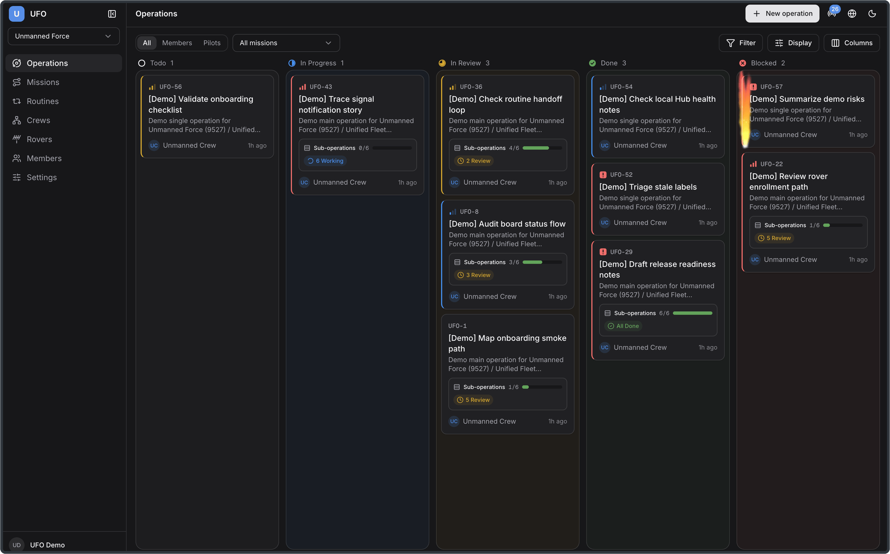
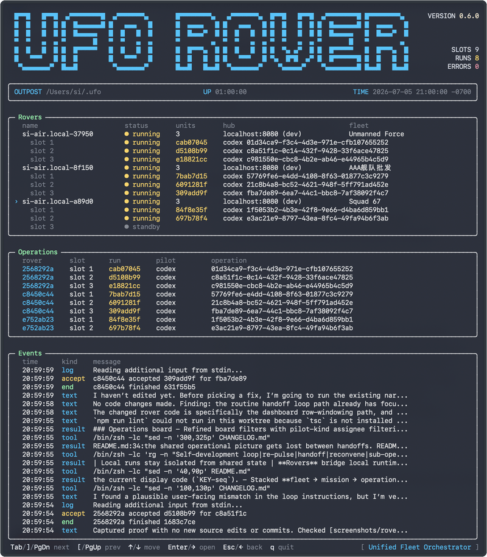
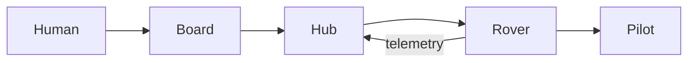
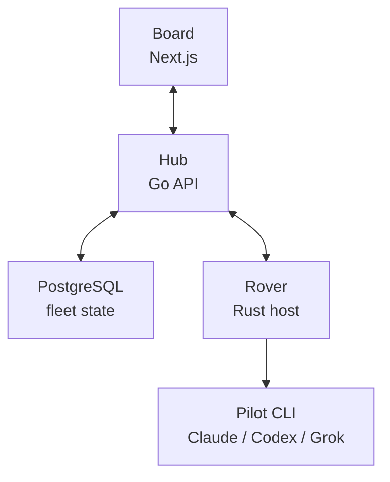

<h1 align="center">UFO: Unified Fleet Orchestrator</h1>

<p align="center"><strong>An open-source zero-human ops platform</strong> 🦾🩶</p>

<p align="center">
  Orchestrate AI sessions into a zero-human ops loop: retain context, route
  work, and hand off across runs!
</p>

<p align="center">
  <a href="https://github.com/fengsi/ufo/actions/workflows/ci.yml"></a>
  <a href="https://github.com/fengsi/ufo/releases"></a>
  <a href="https://crates.io/crates/ufo-cli"></a>
  <a href="LICENSE"></a>
  
  <a href="apps/api/go.mod"></a>
  <a href="apps/web/package.json"></a>
  <a href="apps/rover/Cargo.toml"></a>
  <a href="https://gitmoji.dev"></a>
</p>

<p align="center"><strong>English | <a href="README.zh-CN.md">简体中文</a></strong></p>


> **Public beta.** The core loop works. Prefer
> [tagged releases](https://github.com/fengsi/ufo/releases); APIs and schema
> may still change before 1.0. See [CHANGELOG.md](CHANGELOG.md).

---

## What is UFO?

UFO orchestrates AI sessions into a zero-human ops loop for complex work, not
just coding. Work lands on the **board**, context keeps compounding, and each
run can hand off cleanly to the next while workspaces and credentials stay on
machines you control.

<picture>
  <source
    media="(prefers-color-scheme: dark)"
    srcset=".github/assets/hub-light.png"
  >
  <source
    media="(prefers-color-scheme: light)"
    srcset=".github/assets/hub-dark.png"
  >
  
</picture>

---

## Why UFO?

- **Shared operations.** Operations carry context and history across AI
  sessions, with board status, signals, diffs, and handoffs in one place.
- **Local execution.** Rovers run existing AI CLIs on machines you control, so
  workspaces and credentials stay local.
- **Compounding know-how.** Routines continue work across runs while mission
  learning turns completed operations into reusable docs and skills.

---

## Features

- **Operate together.** Missions frame projects; operations move through
  Kanban, list, and lane views with comments, assets, labels, relationships,
  signals, crews, and membership.
- **Run pilots locally.** Rovers use
  [supported AI CLIs](apps/rover/README.md#pilots-and-tags) on machines you
  control. Code and secrets stay local, and every run gets an isolated
  worktree.
- **Keep work moving.** Routines pulse now or on a schedule and can continue
  their Loop after an operation is done. Optional auto-commit supports
  unattended legs with stall and fail-closed guards.
- **Learn and ship.** Mission learning carries reusable experience into shared
  docs and skills for future operations. Forges connect GitHub or GitLab so
  rovers can push and ship pull requests with a host-side token.

---

## Quick start (local)

No cloud account is required.

**Needs:** [Docker](https://docs.docker.com/get-docker/) and
[Rust/Cargo](https://rustup.rs), plus at least one
[supported AI CLI](apps/rover/README.md#pilots-and-tags) on `PATH`.

### 1. Start the Hub

```bash
git clone https://github.com/fengsi/ufo.git
cd ufo
scripts/dev.sh up          # Postgres + API + web (live reload)
```

Open **http://localhost:3000** and create an account. UFO opens a personal
**fleet** and a default **Launch Bay** **mission**.

### 2. Enroll and start a rover

```bash
scripts/dev.sh rover enroll
scripts/dev.sh rover
```

Approve enrollment in the browser when prompted.

### 3. Dispatch the first operation

1. Open a **mission** (project frame on the fleet).
2. Create an **operation** and assign a **pilot**.
3. Watch the board: queued → accepted → running → review/done, with live
   updates and a diff when code changed.

That's the loop. Routines, skills, crews, and auto-commit all build on it.



---

## Rover CLI binary (optional)

Both rover commands need a running Hub. Today's public beta path is a local
Hub from `scripts/dev.sh up`; use either the dev wrapper or the released CLI
binary to connect a rover to it.

```bash
# macOS / Linux
curl -fsSL https://getufo.dev/install.sh | sh
# or: brew install fengsi/ufo/ufo-cli

# with the local Hub already running from scripts/dev.sh up
ufo rover enroll --hub http://localhost:8080
ufo rover start
```

To connect the same host to another Hub, enroll again with that Hub URL (or
use repeated `--config` entries with enrollment codes). `ufo rover start`
loads the stored enrollments from `~/.ufo/rovers.json`. Set `units` per rover
to accept concurrent operations while reusing the same local AI CLIs.

**Windows:** download the matching archive from
[Releases](https://github.com/fengsi/ufo/releases), put `ufo.exe` on `PATH`,
then the same `enroll` / `start` commands. Details:
[apps/rover/README.md](apps/rover/README.md).

Release artifacts cover **macOS, FreeBSD, Linux, and Windows**. Routine CI
tests run on macOS, Linux, and Windows.

---

## Words on the board

| Word | Plain meaning |
| --- | --- |
| **Fleet** | Trust boundary: people, rovers, missions, and operations |
| **Hub** | Control plane: API and fleet state |
| **Board** | Web UI for the fleet |
| **Mission** | Project frame on a fleet (codes like `MSJ-123`) |
| **Operation** | One work item on the board |
| **Rover** | Local runtime connector that accepts work and runs pilots |
| **Pilot** | Local AI CLI the rover runs |
| **Routine** | Reusable operation definition with an optional Pulse schedule and Loop policy |
| **Skill** | Reusable instruction pack bound to ops or crews |
| **Crew** | Pilots + humans under one assignment target |


```mermaid
flowchart LR
    human["Human"] --> board["Board"]
    board --> hub["Hub"]
    hub --> rover["Rover"]
    rover --> pilot["Pilot"]
    rover -- telemetry --> hub
```

---

## How the pieces fit

| Piece | Role |
| --- | --- |
| [`apps/web`](apps/web) | Board |
| [`apps/api`](apps/api) | Hub (auth, queues, OpenAPI) |
| [`apps/rover`](apps/rover) | Rover (`ufo-cli`): local runtime that runs pilots |


```mermaid
flowchart TD
    web["Board<br/>Next.js"] <--> api["Hub<br/>Go API"]
    api <--> db["PostgreSQL<br/>fleet state"]
    api <--> rover["Rover<br/>Rust host"]
    rover --> pilot["Pilot CLI<br/>Claude / Codex / Grok"]
```

**Trust note:** Anyone in a fleet can dispatch work to that fleet's rovers.
Pilots run with the privileges of the OS user that started the rover. Use a
dedicated account or host for serious fleets. See [SECURITY.md](SECURITY.md).

---

## Configuration

Copy [`.env.example`](.env.example) to `.env` for overrides.

| Variable | Default | Who |
| --- | --- | --- |
| `UFO_HUB_URL` | `http://localhost:8080` | rover, web |
| `UFO_HUB_DATABASE_URL` | local Docker Postgres | api |
| `UFO_HUB_JWT_PRIVATE_KEY` | required in production | api |
| `UFO_HUB_JWT_ALLOW_EPHEMERAL` | set `1` for local-only | api |
| `UFO_HUB_MIN_ROVER_VERSION` | current release | api |
| `UFO_HUB_MAX_ROVER_VERSION` | unset | api |
| `UFO_ROVER_FORGE_TOKEN` | unset | rover (forge ship) |

Rover version bounds use semver. Invalid bounds, or a maximum below the
effective minimum, stop the Hub at startup. Rovers wait for a reachable,
compatible Hub and recheck compatibility after reconnecting; upgrade with
`ufo rover upgrade` when the Hub requires a newer rover.

`UFO_ROVER_FORGE_TOKEN` is the default env name for a forge credential on the
rover host (GitHub PAT, GitLab token, etc.). Integrations can point at another
env name; export that name where `ufo rover start` runs. The Hub stores the
name only, never the secret.

Full list: [`.env.example`](.env.example),
[`.env.production.example`](.env.production.example).

---

## Advanced: host-only API/web

Go ≥ 1.26 and Node ≥ 20.9 on the host; Postgres still via Docker:

```bash
scripts/dev.sh db
scripts/dev.sh api
scripts/dev.sh web
scripts/dev.sh rover enroll
```

Contributor workflow: [CONTRIBUTING.md](CONTRIBUTING.md).

---

## Troubleshooting

| Symptom | Try |
| --- | --- |
| Web won't load | `docker compose ps` · `docker compose logs -f web api postgres` |
| API can't reach DB | `scripts/dev.sh up` or `db`; check `UFO_HUB_DATABASE_URL` |
| Browser calls fail after login | Set `UFO_HUB_ALLOWED_ORIGINS` to the web origin; secure cookies only on HTTPS |
| Rover won't enroll | `--hub` must be the **API** origin; approve in the browser |
| Online but idle | Pilot assigned? CLI on `PATH`? Tags match? |
| Wipe local Docker data | `scripts/dev.sh down -v && scripts/dev.sh up` (destructive) |

---

## Docs

| Doc | For |
| --- | --- |
| [Rover CLI](apps/rover/README.md) | Install, enroll, TUI, headless |
| [OpenAPI](apps/api/internal/spec/openapi.yaml) | HTTP contract |
| [Contributing](CONTRIBUTING.md) | PRs, monorepo, beta DB notes |
| [Security](SECURITY.md) | Fleet trust and rover risk |
| [Changelog](CHANGELOG.md) | Releases |

---

## Contributing

Issues and PRs are welcome. Start with [CONTRIBUTING.md](CONTRIBUTING.md).

Schema changes are SQL migrations under
`apps/api/internal/migrate/migrations/` (applied on Hub startup). See
[CONTRIBUTING.md](CONTRIBUTING.md). When release notes mention a schema reset,
back up or wipe local DBs before upgrading.

---

## License

UFO is licensed under [BSD 3-Clause](LICENSE). Third-party license notices are
listed in [THIRD_PARTY_NOTICES.md](THIRD_PARTY_NOTICES.md).
