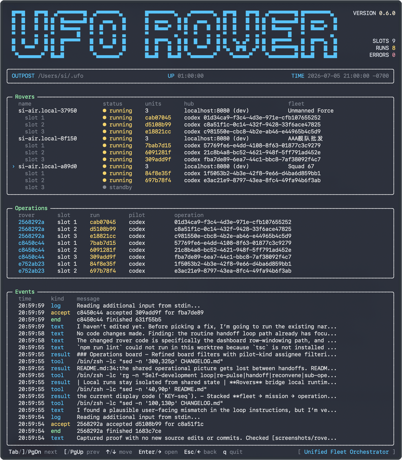
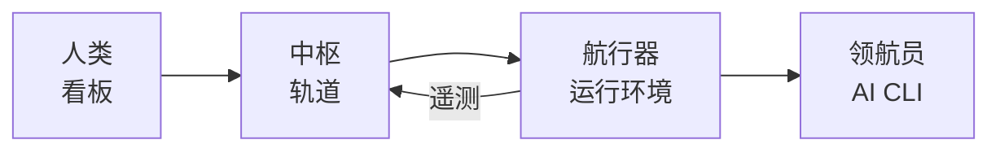
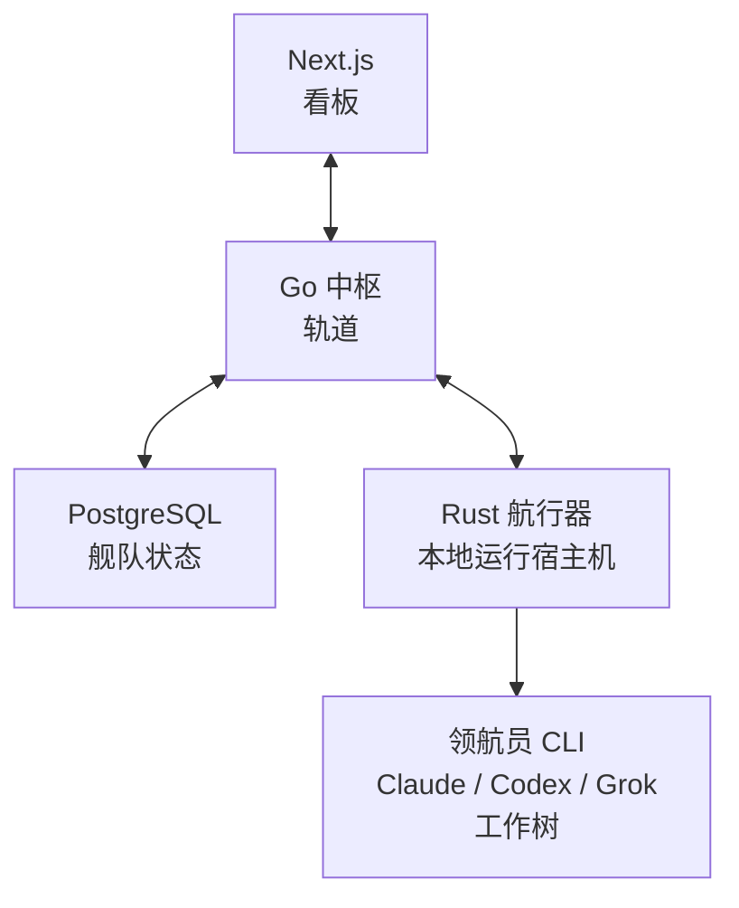

<h1 align="center">UFO：统一舰队编排引擎</h1>

<p align="center"><strong>开源的零人工运维平台</strong> 🦾🩶</p>

<p align="center">
  把 AI 会话接入零人工运维循环：保留上下文，分派工作，并跨迭代交接！
</p>

<p align="center">
  <a href="https://github.com/fengsi/ufo/actions/workflows/ci.yml"></a>
  <a href="https://github.com/fengsi/ufo/releases"></a>
  <a href="https://crates.io/crates/ufo-cli"></a>
  <a href="LICENSE"></a>
  <a href="CHANGELOG.md"></a>
  <a href="apps/api/go.mod"></a>
  <a href="apps/web/package.json"></a>
  <a href="apps/rover/Cargo.toml"></a>
  <a href="https://gitmoji.dev"></a>
</p>

<p align="center"><strong><a href="README.md">English</a> | 简体中文</strong></p>


> **公开 beta。** 核心循环已经可用。建议使用
> [tagged releases](https://github.com/fengsi/ufo/releases)；1.0 之前 API 和
> schema 仍可能变化，升级注意事项见 [CHANGELOG.md](CHANGELOG.md)。

---

## UFO 是什么？

UFO 把 AI 会话连接成面向复杂工作的零人工运维循环：不只写代码，也能承接日常业务和系统操作。工作有看板可追踪，上下文会持续沉淀，每次迭代都能干净交接；
项目数据与凭证继续留在你自己的机器上。

用 UFO 的说法：**中枢（Hub）** 是控制平面，**舰队（Fleet）** 是信任边界，**任务（Mission）** 框定项目。
**行动（Operation）** 是看板上的工作项，**巡航（Routine）** 负责按计划或在完成后触发工作，**航行器（Rover）** 则在
本地主机运行 **领航员（Pilot）**，也就是 Claude Code、Codex 和 Grok Build 这类 AI CLI。

---

## 为什么是 UFO？

大多数 agent 工作流仍然分布在不同会话里：聊天标签页、终端、本地工作树和人工笔记各记一段。单次运行可以完成工作，但交接之间缺少统一的上下文、
共享历史和持续编排。

| 独立 AI 会话 | UFO |
| --- | --- |
| 上下文留在各自会话里 | **行动** 在舰队里保留共享历史 |
| 交接主要靠人手整理 | **巡航** 和 **乘组** 启动下一段工作 |
| 本地运行缺少共享状态 | **航行器** 把本地运行环境接入同一个中枢 |
| “谁跑了什么？”靠口口相传 | 看板、**信号**、diff、成员关系 |

人类继续使用 **Claude Code**、**Codex**、**Grok Build** 和其他工具。UFO 做的是 **舰队** 层：一个中枢，
多台航行器，共享同一份上下文。

---

## 功能

- **派发行动** — 创建一个 **行动**，指定 **领航员**；航行器将本地运行环境接入舰队。
- **任务控制看板** — 看板、列表、泳道；评论、资产、标签、关联关系与 **信号** 都在这里。
- **本地仍在本地** — 代码和密钥留在人类控制的主机上；不强制依赖云。
- **隔离工作树** — 每次运行都有自己的检出；准备好后再应用回源码、提交到分支，或从源码刷新。
- **自主航段** — **巡航** 在行动 **已完成** 后继续出航；可选自动提交分支，用于无人值守的自研循环，并带停滞与 fail-closed
  防护。
- **舰队技能** — 可复用的 `SKILL.md` 包，绑定到行动或 **乘组**；执行时写入工作树给领航员使用。
- **乘组与成员** — 舰队、角色、邮件邀请、乘组（领航员 + 人类成员）。
- **带上你的领航员** — Claude Code、Codex、Antigravity、Grok Build、Cursor Agent、GitHub
  Copilot、Amp Code、OpenCode、OpenClaw、Hermes、Pi、Kimi、Kiro、CodeBuddy Code（可执行文件在
  `PATH` 上）。

---

## 快速开始（本地）

不需要云账号。先在这台机器上启动 **中枢**，再连接一台 **航行器**。

**需要：** [Docker](https://docs.docker.com/get-docker/) 和
[Rust/Cargo](https://rustup.rs)（航行器运行在 **host** 上，这样才能使用本地文件和 AI CLI）。

### 1. 启动中枢

```bash
git clone https://github.com/fengsi/ufo.git
cd ufo
scripts/dev.sh up          # Postgres + API + web (live reload)
```

- 看板（任务控制）：**http://localhost:3000**
- 中枢 API（rover `--hub`）：**http://localhost:8080**

### 2. 注册

打开 **http://localhost:3000** 创建账号。UFO 会创建个人 **舰队**，并带一个默认的 **Launch Bay**
**任务**。

### 3. 接入航行器

```bash
scripts/dev.sh rover enroll
```

按提示在浏览器中批准接入。之后启动：

```bash
scripts/dev.sh rover
```

> **航行器（Rover）** — 连接本地运行环境的节点；它从中枢接受行动，调用本地 AI CLI **领航员（Pilot）** 在隔离工作树里执行，
> 并把状态和 diff 回传到看板。

同一台主机上的航行器可以保存多份接入，包括接入不同中枢。启动一次航行器后，每份已保存的接入都会保持待命；按航行器配置并发单元（`units`），即可用同一套
本地 AI CLI 同时承接多个并发行动。

### 4. 把领航员放到 PATH 上

安装至少一个受支持的 CLI，并确保它在 `PATH` 上，例如 `claude`、`codex`、`grok`、`copilot` 等。航行器只会运行
它能找到的领航员。

### 5. 派发第一个行动

1. 打开一个 **任务**（舰队里的项目框架）。
2. 放入一个 **行动**（工作项）。
3. 指定一个 **领航员**。
4. 看着看板流转：queued → accepted → running → review/done；过程中会有实时更新，代码变更也会显示 diff。

这就是基本循环。巡航、技能、乘组和 auto-commit 都建立在它之上。

---

## 截图

**中枢（Hub）**


**航行器（Rover）**



---

## 航行器 CLI（Rover CLI，可选）

两个 `ufo rover` 命令都需要一个正在运行的中枢。当前公开 beta 的路径是先用 `scripts/dev.sh up` 启动本地中枢；之后
可以用开发脚本，也可以用发布版 CLI 连接航行器。

```bash
# macOS / Linux
curl -fsSL https://getufo.dev/install.sh | sh
# or: brew install fengsi/ufo/ufo-cli

# with the local Hub already running from scripts/dev.sh up
ufo rover enroll --hub http://localhost:8080
ufo rover start
```

要把同一台主机接入另一个中枢，再对那个中枢执行一次 `ufo rover enroll`；也可以用多个带接入码的 `--config`。
`ufo rover start` 会从 `~/.ufo/rovers.json` 加载已保存的接入。

**Windows：** 从 [Releases](https://github.com/fengsi/ufo/releases) 下载对应压缩包，把
`ufo.exe` 放到 `PATH` 上，然后使用同样的 `enroll` / `start` 命令。详情见
[apps/rover/README.md](apps/rover/README.md)。

发布版本提供适用于 macOS、FreeBSD、Linux 和 Windows 的航行器可执行文件；常规 CI 只在 macOS、Linux 和
Windows 上运行测试。

---

## 看板上的词

| 词 | 直白含义 |
| --- | --- |
| **舰队（Fleet）** | 信任边界；拥有任务、行动和航行器 |
| **任务（Mission）** | 舰队里的项目框架，代码形如 `MSJ-123` |
| **行动（Operation）** | 看板上的一个工作项 |
| **中枢（Hub）** | “轨道上”的控制平面，包含 API 和状态 |
| **航行器（Rover）** | 连接本地运行环境、接受行动并运行领航员的节点 |
| **领航员（Pilot）** | 航行器调用的本地 AI CLI |
| **巡航（Routine）** | 重复启动模式，可以是出航计划或完成后继续出航循环 |
| **技能（Skill）** | 绑定到行动或乘组的可复用指令包 |
| **乘组（Crew）** | 领航员 + 人类成员组成的分配目标 |



---

## 组件关系

| 组件 | 作用 |
| --- | --- |
| [`apps/web`](apps/web) | 任务控制看板 |
| [`apps/api`](apps/api) | 中枢：auth、queues、OpenAPI |
| [`apps/rover`](apps/rover) | 本地运行环境连接器，也就是运行领航员的 `ufo-cli` |



**信任说明：** 舰队里的任何成员都可以把行动派给该舰队的航行器。领航员会以启动航行器的 OS 用户身份运行。严肃舰队建议使用专用账号或主机；见
[SECURITY.md](SECURITY.md)。

---

## 配置

复制 [`.env.example`](.env.example) 到 `.env` 来覆盖默认配置。

| 变量 | 默认值 | 使用方 |
| --- | --- | --- |
| `UFO_HUB_URL` | `http://localhost:8080` | 航行器, web |
| `UFO_HUB_DATABASE_URL` | local Docker Postgres | api |
| `UFO_HUB_JWT_PRIVATE_KEY` | production 必填 | api |
| `UFO_HUB_JWT_ALLOW_EPHEMERAL` | 本地开发可设 `1` | api |

完整列表见 [`.env.example`](.env.example) 和
[`.env.production.example`](.env.production.example)。

---

## 进阶：host-only API/web

Host 上需要 Go ≥ 1.26 和 Node ≥ 20.9；Postgres 仍由 Docker 运行：

```bash
scripts/dev.sh db
scripts/dev.sh api
scripts/dev.sh web
scripts/dev.sh rover enroll
```

贡献者流程见 [CONTRIBUTING.md](CONTRIBUTING.md)。

---

## 排障

| 现象 | 尝试 |
| --- | --- |
| Web 打不开 | `docker compose ps` · `docker compose logs -f web api postgres` |
| API 连不上 DB | `scripts/dev.sh up` 或 `db`；检查 `UFO_HUB_DATABASE_URL` |
| 登录后浏览器请求失败 | 将 `UFO_HUB_ALLOWED_ORIGINS` 设为 web origin；secure cookies 只用于 HTTPS |
| 航行器无法接入 | `--hub` 必须是 **API** origin；在浏览器里批准 |
| 在线但空闲 | 是否指定领航员？CLI 在 `PATH` 上？Tags 匹配吗？ |
| 清空本地 Docker 数据 | `scripts/dev.sh down -v && scripts/dev.sh up`（破坏性） |

---

## 文档

| 文档 | 内容 |
| --- | --- |
| [Rover CLI](apps/rover/README.md) | 安装、接入、TUI、headless |
| [OpenAPI](apps/api/internal/spec/openapi.yaml) | HTTP 契约 |
| [Contributing](CONTRIBUTING.md) | PR、monorepo、beta DB 注意事项 |
| [Security](SECURITY.md) | 舰队信任边界与航行器风险 |
| [Changelog](CHANGELOG.md) | 发布记录 |

---

## 参与贡献

欢迎提交 issue 和 PR；请先阅读 [CONTRIBUTING.md](CONTRIBUTING.md)。

公开 beta 期间，schema 变更通常会直接进入一个 init migration。如果发布说明提到 schema reset，请在升级前备份或清空
本地 DB。

---

## 许可证

本项目使用 [BSD 3-Clause](LICENSE) 许可证。第三方许可声明见
[THIRD_PARTY_NOTICES.md](THIRD_PARTY_NOTICES.md)。
