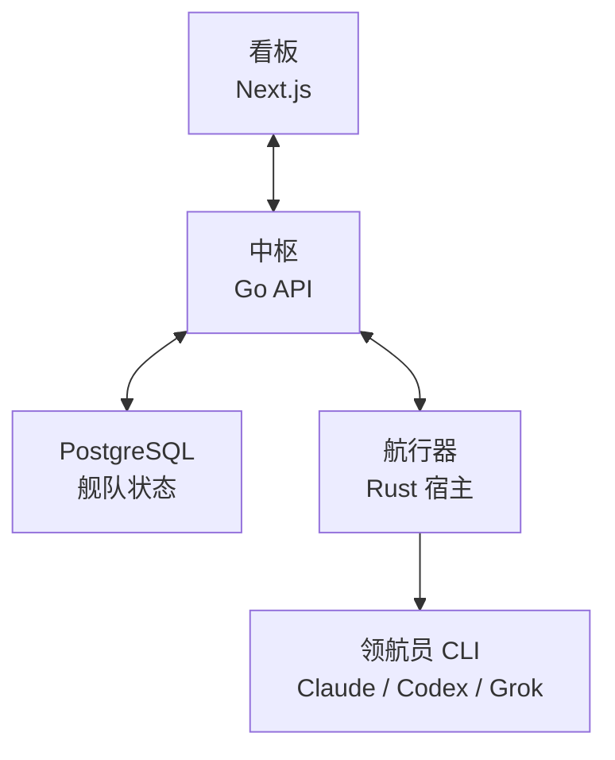

<h1 align="center">UFO：统一舰队编排引擎</h1>

<p align="center"><strong>开源的无人值守自动化平台</strong> 🦾🩶</p>

<p align="center">
将 AI 会话编排为无人值守的工作闭环：持续沉淀上下文，分派工作，并跨迭代交接！
</p>

<p align="center">
  <a href="https://github.com/fengsi/ufo/actions/workflows/ci.yml"></a>
  <a href="https://github.com/fengsi/ufo/releases"></a>
  <a href="https://crates.io/crates/ufo-cli"></a>
  <a href="LICENSE"></a>
  
  <a href="apps/api/go.mod"></a>
  <a href="apps/web/package.json"></a>
  <a href="apps/rover/Cargo.toml"></a>
  <a href="https://gitmoji.dev"></a>
</p>

<p align="center"><strong><a href="README.md">English</a> | 简体中文</strong></p>


> **公开测试版。** 核心闭环已经可用。建议使用
> [带版本标签的发布版本](https://github.com/fengsi/ufo/releases)；1.0 之前 API 和数据库结构仍可能变化，
> 升级注意事项见 [CHANGELOG.md](CHANGELOG.md)。

---

## UFO 是什么？

UFO 将 AI 会话编排为面向复杂工作的无人值守闭环，不只写代码。工作落在 **看板** 上，上下文会持续沉淀，每次迭代都能干净交接；工作区与凭证继续留在
你自己的机器上。

<picture>
  <source
    media="(prefers-color-scheme: dark)"
    srcset=".github/assets/hub-light.png"
  >
  <source
    media="(prefers-color-scheme: light)"
    srcset=".github/assets/hub-dark.png"
  >
  
</picture>

---

## 为什么是 UFO？

- **共享行动。** 行动把各个 AI 会话的上下文和历史串起来；状态、信号、代码差异和交接统一留在看板上。
- **本地执行。** 航行器在你控制的机器上运行现有 AI CLI，工作区和凭证无需离开本机。
- **持续沉淀。** 巡航让工作跨迭代继续推进；任务经验把已完成行动中的可复用内容沉淀为文档和技能。

---

## 功能

- **统一协作。** 任务框定项目，行动在看板、列表和泳道视图中流转，并带有评论、资产、标签、关联关系、信号、乘组和成员管理。
- **在本地运行领航员。** 航行器在你控制的机器上调用
  [受支持的 AI CLI](apps/rover/README.md#pilots-and-tags)。代码和密钥留在本地，每次运行都使用隔离工作树。
- **安全持续推进。** 巡航可以立即或定时发送脉冲，并在行动完成后继续循环。可选的自动提交支持无人值守航段，同时提供防卡死和失败即停机制。
- **沉淀并交付。** 任务经验把可复用内容写入共享文档和技能，供后续行动使用。代码托管接入 GitHub 或 GitLab，让航行器使用本机令牌推送代码
  并处理拉取请求和合并请求。

---

## 快速开始（本地）

不需要云账号。

**需要：** [Docker](https://docs.docker.com/get-docker/) 和
[Rust/Cargo](https://rustup.rs)，以及至少一个位于 `PATH` 上的
[受支持 AI CLI](apps/rover/README.md#pilots-and-tags)。

### 1. 启动中枢

```bash
git clone https://github.com/fengsi/ufo.git
cd ufo
scripts/dev.sh up          # Postgres + API + web (live reload)
```

打开 **http://localhost:3000** 创建账号。UFO 会创建个人 **舰队**，并带一个默认的 **Launch Bay**
**任务**。

### 2. 接入并启动航行器

```bash
scripts/dev.sh rover enroll
scripts/dev.sh rover
```

按提示在浏览器中批准接入。

### 3. 派发第一个行动

1. 打开一个 **任务**（舰队里的项目框架）。
2. 创建一个 **行动**，并指定一个 **领航员**。
3. 在看板上观察状态流转：待承接 → 已承接 → 运行中 → 审阅/完成；过程中会有实时更新，代码变更也会显示差异内容。

这就是基本闭环。巡航、技能、乘组和自动提交都建立在它之上。


---

## 航行器 CLI（Rover CLI，可选）

两个 `ufo rover` 命令都需要一个正在运行的中枢。当前公开测试版的路径是先用 `scripts/dev.sh up` 启动本地中枢；之后可以用开发
脚本，也可以用发布版 CLI 连接航行器。

```bash
# macOS / Linux
curl -fsSL https://getufo.dev/install.sh | sh
# 或者：brew install fengsi/ufo/ufo-cli

# 已通过 scripts/dev.sh up 启动本地中枢
ufo rover enroll --hub http://localhost:8080
ufo rover start
```

要把同一台主机接入另一个中枢，再对那个中枢执行一次 `ufo rover enroll`；也可以用多个带接入码的 `--config`。
`ufo rover start` 会从 `~/.ufo/rovers.json` 加载已保存的接入。为每台航行器设置并发单元（`units`），即可复用同
一套本地 AI CLI 同时承接多个行动。

**Windows：** 从[发布页面](https://github.com/fengsi/ufo/releases)下载对应压缩包，把
`ufo.exe` 放到 `PATH` 上，然后使用同样的 `enroll` / `start` 命令。详情见
[apps/rover/README.md](apps/rover/README.md)。

发布版本提供适用于 macOS、FreeBSD、Linux 和 Windows 的航行器可执行文件；常规 CI 只在 macOS、Linux 和
Windows 上运行测试。

---

## 看板核心术语

| 术语 | 含义 |
| --- | --- |
| **舰队（Fleet）** | 信任边界：人、航行器、任务与行动 |
| **中枢（Hub）** | 控制平面：API 与舰队状态 |
| **看板（Board）** | 面向舰队的网页界面 |
| **任务（Mission）** | 舰队里的项目框架，代码形如 `MSJ-123` |
| **行动（Operation）** | 看板上的一个工作项 |
| **航行器（Rover）** | 连接本地运行环境、接受行动并运行领航员的节点 |
| **领航员（Pilot）** | 航行器调用的本地 AI CLI |
| **巡航（Routine）** | 可复用的行动定义，可手动或定时发送脉冲，并在成功后继续循环 |
| **技能（Skill）** | 绑定到行动或乘组的可复用指令包 |
| **乘组（Crew）** | 领航员 + 人类成员组成的分配目标 |


```mermaid
flowchart LR
    human["人类"] --> board["看板"]
    board --> hub["中枢"]
    hub --> rover["航行器"]
    rover --> pilot["领航员"]
    rover -- 遥测 --> hub
```

---

## 组件关系

| 组件 | 作用 |
| --- | --- |
| [`apps/web`](apps/web) | 看板 |
| [`apps/api`](apps/api) | 中枢（认证、队列、OpenAPI） |
| [`apps/rover`](apps/rover) | 航行器（`ufo-cli`）：本地运行环境，运行领航员 |


```mermaid
flowchart TD
    web["看板<br/>Next.js"] <--> api["中枢<br/>Go API"]
    api <--> db["PostgreSQL<br/>舰队状态"]
    api <--> rover["航行器<br/>Rust 宿主"]
    rover --> pilot["领航员 CLI<br/>Claude / Codex / Grok"]
```

**信任说明：** 舰队里的任何成员都可以把行动派给该舰队的航行器。领航员以启动航行器的操作系统用户权限运行。面向生产环境的舰队请使用专用账号或独立主机；详
见 [SECURITY.md](SECURITY.md)。

---

## 配置

复制 [`.env.example`](.env.example) 到 `.env` 来覆盖默认配置。

| 变量 | 默认值 | 使用方 |
| --- | --- | --- |
| `UFO_HUB_URL` | `http://localhost:8080` | 航行器、网页端 |
| `UFO_HUB_DATABASE_URL` | 本地 Docker Postgres | 中枢 |
| `UFO_HUB_JWT_PRIVATE_KEY` | 生产环境必填 | 中枢 |
| `UFO_HUB_JWT_ALLOW_EPHEMERAL` | 本地开发可设 `1` | 中枢 |
| `UFO_HUB_MIN_ROVER_VERSION` | 当前版本 | 中枢 |
| `UFO_HUB_MAX_ROVER_VERSION` | 未设置 | 中枢 |
| `UFO_ROVER_FORGE_TOKEN` | 未设置 | 航行器（代码托管推送/合并请求） |

航行器版本范围使用 semver。版本格式无效，或最大版本低于实际最小版本时，中枢会拒绝启动。航行器会等待可访问且兼容的中枢，并在重连后重新检查兼容性；中枢
要求新版航行器时，运行 `ufo rover upgrade` 升级。

`UFO_ROVER_FORGE_TOKEN` 是代码托管凭证在航行器主机上的默认环境变量名（GitHub PAT、GitLab 令牌等）。在“集成”中可改
成其他名称；在运行 `ufo rover start` 的环境中导出对应变量。中枢只保存变量名，不保存密钥。

完整列表见 [`.env.example`](.env.example) 和
[`.env.production.example`](.env.production.example)。

---

## 进阶：仅在主机运行 API 和网页端

主机上需要 Go ≥ 1.26 和 Node ≥ 20.9；Postgres 仍由 Docker 运行：

```bash
scripts/dev.sh db
scripts/dev.sh api
scripts/dev.sh web
scripts/dev.sh rover enroll
```

贡献者流程见 [CONTRIBUTING.md](CONTRIBUTING.md)。

---

## 排障

| 现象 | 尝试 |
| --- | --- |
| Web 打不开 | `docker compose ps` · `docker compose logs -f web api postgres` |
| API 连不上 DB | `scripts/dev.sh up` 或 `db`；检查 `UFO_HUB_DATABASE_URL` |
| 登录后浏览器请求失败 | 将 `UFO_HUB_ALLOWED_ORIGINS` 设为网页端来源；安全 Cookie 只用于 HTTPS |
| 航行器无法接入 | `--hub` 必须是 **API** 来源；在浏览器里批准 |
| 在线但空闲 | 是否指定领航员？CLI 在 `PATH` 上？标签匹配吗？ |
| 清空本地 Docker 数据 | `scripts/dev.sh down -v && scripts/dev.sh up`（破坏性） |

---

## 文档

| 文档 | 内容 |
| --- | --- |
| [航行器 CLI](apps/rover/README.md) | 安装、接入、TUI、无界面运行 |
| [OpenAPI](apps/api/internal/spec/openapi.yaml) | HTTP 契约 |
| [贡献指南](CONTRIBUTING.md) | 拉取请求、单体仓库、测试版数据库注意事项 |
| [安全说明](SECURITY.md) | 舰队信任边界与航行器风险 |
| [更新日志](CHANGELOG.md) | 发布记录 |

---

## 参与贡献

欢迎提交议题和拉取请求；请先阅读 [CONTRIBUTING.md](CONTRIBUTING.md)。

数据库结构变更写入 `apps/api/internal/migrate/migrations/`（中枢启动时自动应用）。详见
[CONTRIBUTING.md](CONTRIBUTING.md)。若发布说明要求重置数据库，升级前请备份或清空本地中枢数据库。

---

## 许可证

本项目使用 [BSD 3-Clause](LICENSE) 许可证。第三方许可声明见
[THIRD_PARTY_NOTICES.md](THIRD_PARTY_NOTICES.md)。
